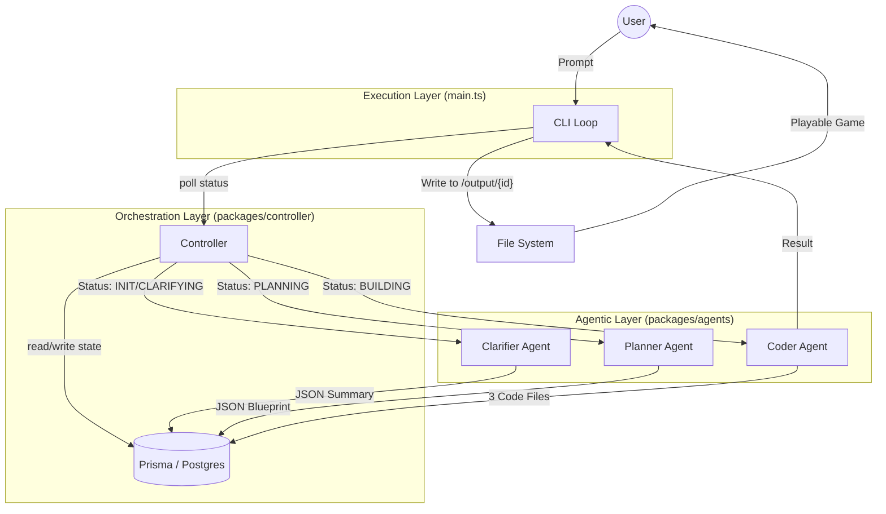
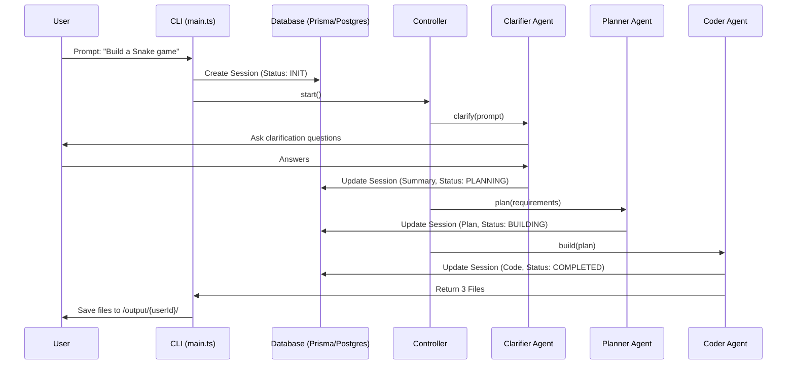

# System Architecture

This document provides a deep dive into the technical architecture of the Agentic AI Builder.

## Architechtual Diagram:

## System Flow

The system follows a linear, state-driven multi-agent orchestration pattern.

## Database Schema

The database is managed via Prisma and PostgreSQL. It tracks user progress and provides a caching layer for LLM responses.

### Models

#### `User`
- **Purpose**: Generic user identity tracking.
- **Key Fields**: `id`, `name`, `email`.

#### `Session`
- **Purpose**: Tracks the lifecycle of a game building request.
- **Status Enum**:
    - `INIT`: Initial prompt received.
    - `CLARIFYING`: Agent is gathering more info.
    - `PLANNING`: Technical design in progress.
    - `BUILDING`: Code generation in progress.
    - `COMPLETED`: Game is ready.
    - `FAILED`: An error occurred.
- **Data Stores**:
    - `clarification`: JSON blob of requirements.
    - `plan`: JSON blob of technical blueprint.
    - `code`: JSON blob containing the final 3 files.

#### `LlmCache`
- **Purpose**: Saves costs and time by caching LLM responses for identical prompt hashes.

---

## Agent Intelligence

### Clarifier Agent
- **System Role**: Game Design Consultant.
- **Logic**: Uses a confidence-based threshold (0.8). If requirements are vague, it generates 2-5 questions. It keeps the summary updated in the database.

### Planner Agent
- **System Role**: Game Architect.
- **Decision Matrix**:
    - Selects **Vanilla JS** for simple tile-based or logic-based games.
    - Selects **Phaser 3** for games requiring gravity, complex physics, or collision groups.

### Coder Agent
- **System Role**: Expert JS Game Developer.
- **Constraint**: Strict instruction to produce 100% playable code without placeholders or external image assets.
